# taskmaster1

* the task master app has three pages:
* Main page (My Tasks contains: title "My Task", picture, 2 buttons(add task, all tasks))

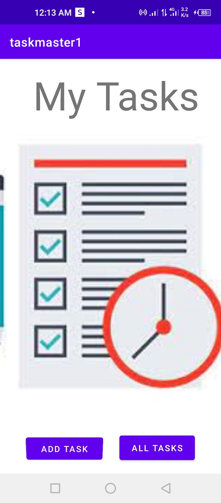

* add Task page (contains title, and some data to write: task title and description, button to submit and  text: total tasks)

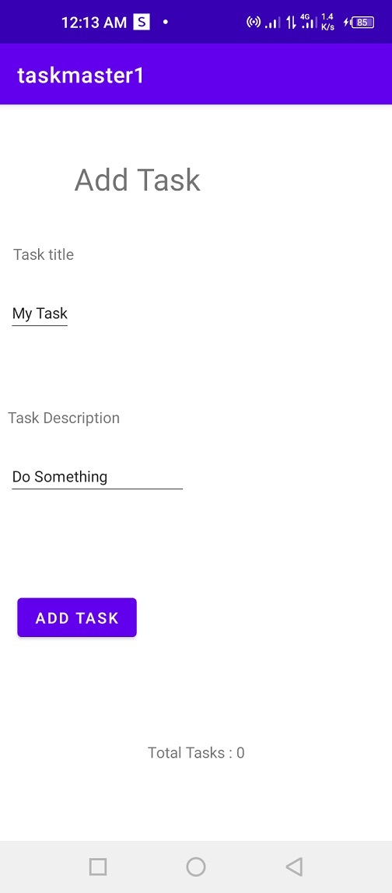

* all tasks page (contains image and back button)

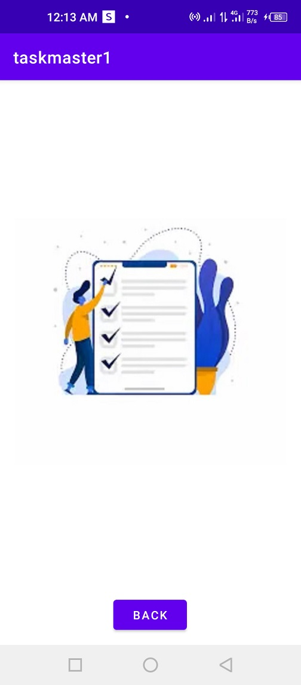

------------------------------------------------------------------
# Lab 27
* Modifid home page (contains settings button ,username appeared , 3 tasks buttons, add task button ,all task button)

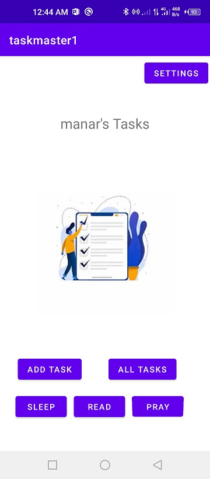

* settings page (add a username to make it appear in home page)

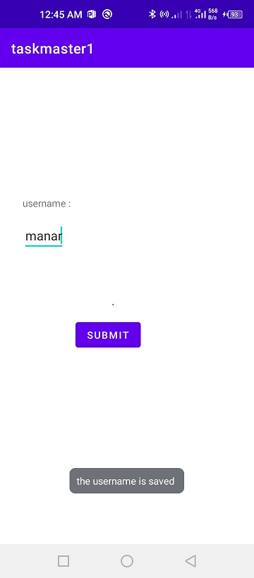

-------------------------------------------------------
# lab 28

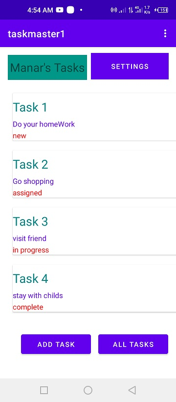

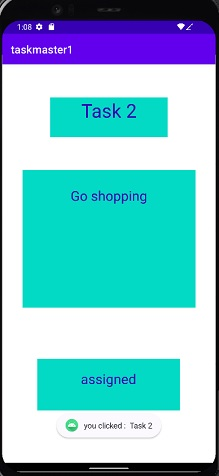

--------------------------------------------------

# Lab29

* add new Task and save it to database
  

  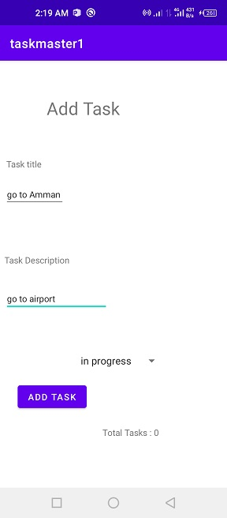

* view (retrive) the task from Database
  

  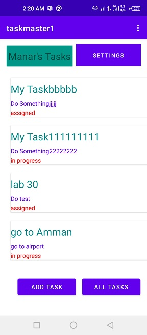

  
* click on the task to view the details (title, description and state)
  

  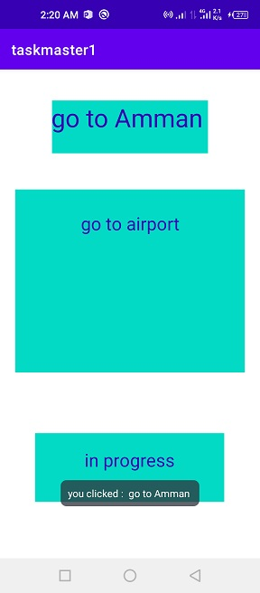
  

----------------------------------------------------------------------------

# Lab 31 
* Espresso test functions added to the the app :
    * assert that important UI elements are displayed on the page
    * tap on a task, and assert that the resulting activity displays the name of that task
    * edit the user’s username, and assert that it says the correct thing on the homepage
    * add task to the recycler view (added to database and viewed in the main page)
    
* screen Shoots
* Main page  
  
  

* addTask page
  
  

* all tasks page (contains image and back button)

* details page

--------------------------------------
# Lab 32 
*  an AWS account created and the Amplify CLI installed 
*  create a Task resource that replicates our existing Task schema.Update all references to the Task data to instead use AWS Amplify to access your data in DynamoDB instead of in Room.

* Main page

  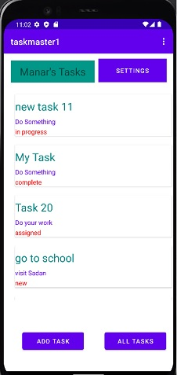

* details page

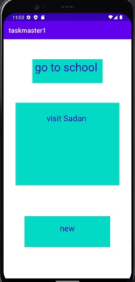

* AWS Tasks page

  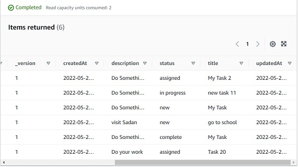
 ---------------------------------------------------
# Lab 33
* 3 Teams added to the database and each user assigned to a Team
* Tasks that added also assigned to a specific Team
* when a user entered his/her data (username and Team ) the tasks for that Team will appeare in the homepage 

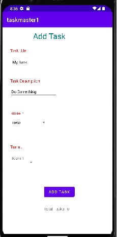

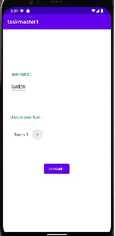

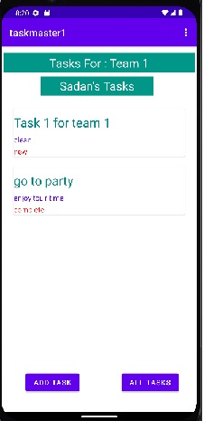

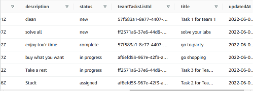

-------------------------------------------------------
 # Lab 34 : 

* app-release-APK is generated in this lab : used in publishing the app in play store 

--------------------------------------------
# Lab 36
* SignUp page 

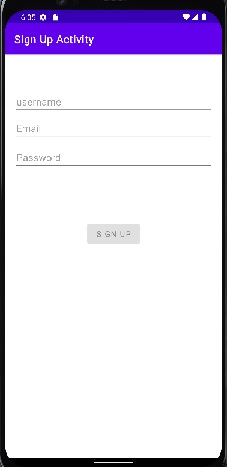

* Login page 

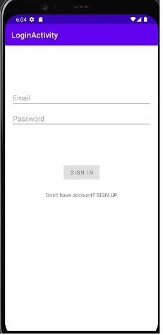

* logout button and display user info 

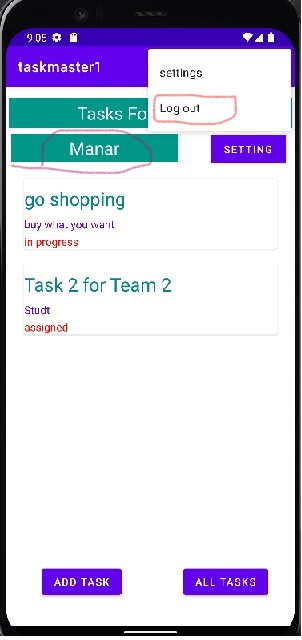
