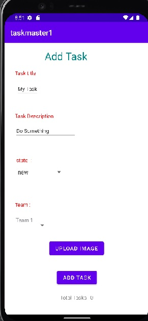
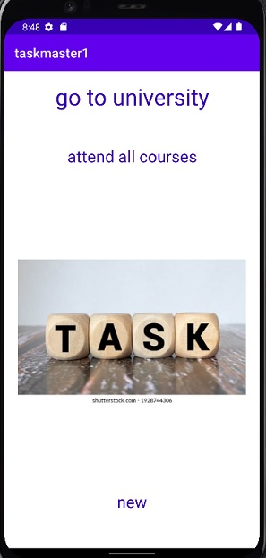
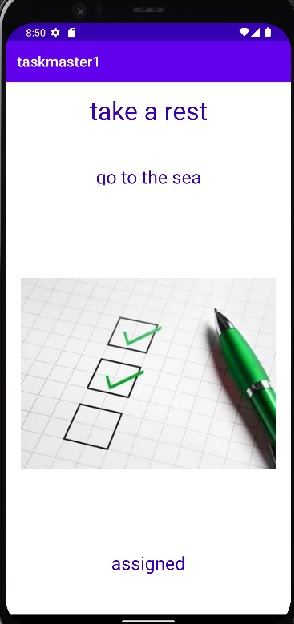

# taskmaster1

* the task master app has three pages:
* Main page (My Tasks contains: title "My Task", picture, 2 buttons(add task, all tasks))

* add Task page (contains title, and some data to write: task title and description, button to submit and  text: total tasks)

* all tasks page (contains image and back button)

------------------------------------------------------------------
# Lab 27
* Modifid home page (contains settings button ,username appeared , 3 tasks buttons, add task button ,all task button)

* settings page (add a username to make it appear in home page)

-------------------------------------------------------
# lab 28

--------------------------------------------------

# Lab29

* add new Task and save it to database
  

  

* view (retrive) the task from Database
  

  

  
* click on the task to view the details (title, description and state)
  

  
  

----------------------------------------------------------------------------

# Lab 31 
* Espresso test functions added to the the app :
    * assert that important UI elements are displayed on the page
    * tap on a task, and assert that the resulting activity displays the name of that task
    * edit the user’s username, and assert that it says the correct thing on the homepage
    * add task to the recycler view (added to database and viewed in the main page)
    
* screen Shoots
* Main page  
  
  

* addTask page
  
  

* all tasks page (contains image and back button)

* details page

--------------------------------------
# Lab 32 
*  an AWS account created and the Amplify CLI installed 
*  create a Task resource that replicates our existing Task schema.Update all references to the Task data to instead use AWS Amplify to access your data in DynamoDB instead of in Room.

* Main page

  

* details page

* AWS Tasks page

  
 ---------------------------------------------------
# Lab 33
* 3 Teams added to the database and each user assigned to a Team
* Tasks that added also assigned to a specific Team
* when a user entered his/her data (username and Team ) the tasks for that Team will appeare in the homepage 

-------------------------------------------------------
 # Lab 34 : 

* app-release-APK is generated in this lab : used in publishing the app in play store 
*publishing : makes your Android applications available to users
  * perform two main tasks publish an Android application:
    * prepare the application for release
    * release the application to users

* Preparing app for release:
  * remove Log calls and remove the android:debuggable attribute from your manifest file.
  * provide values for the android:versionCode and android:versionName attributes, which are located in the element.
  * configure several other settings to meet Google Play requirements or accommodate whatever method you're using to release your application.

* Building and signing a release version of your application
  * use the Gradle build files with the release build type to build and sign a release version of your application.
  
* Testing the release version of your application.
* Updating application resources for release
    * be sure that all application resources such as multimedia files and graphics are updated and included with your application
* Preparing remote servers and services that your application depends on

* you will need to get a private key for signing your application

* You will also need to create an icon for your application

* you may want to prepare an End User License Agreement (EULA) to protect your person, organization, and intellectual property.

* on your own website
  * by sending an application directly to a user.
  * prepare your application for release in the normal way
  * need host the release-ready APK file on your website and provide a download link to users.
  * it is relatively easy to release your application on your own website, it can be inefficient

--------------------------------------------
# Lab 36
* SignUp page 

* Login page 

* logout button and display user info 

----------------------------------
# Lab 37
* add Task page:
  now in addTask page the task can added with an image assigned to each task, or without image 

* TaskDetails page :
  the task can be viewed with it's pproperities(Title , Body , Status , and an image (if exist))

